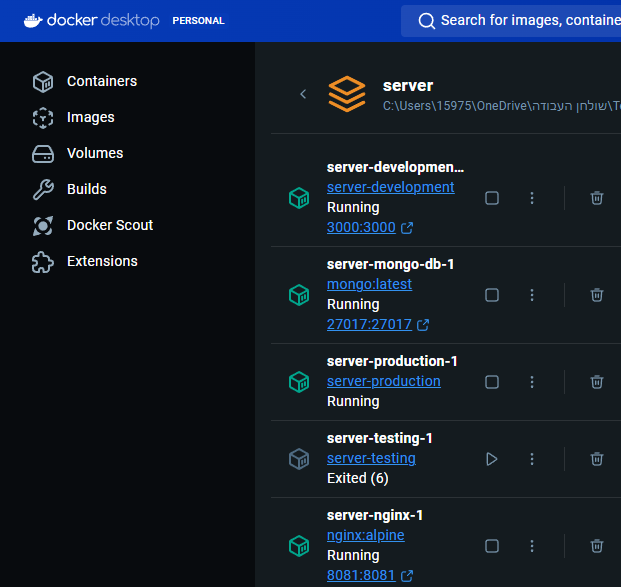
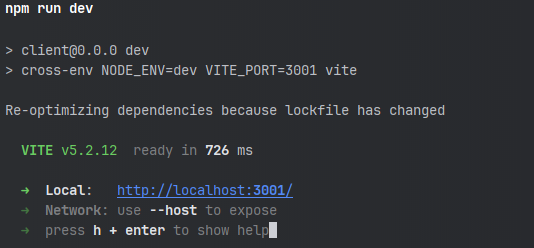
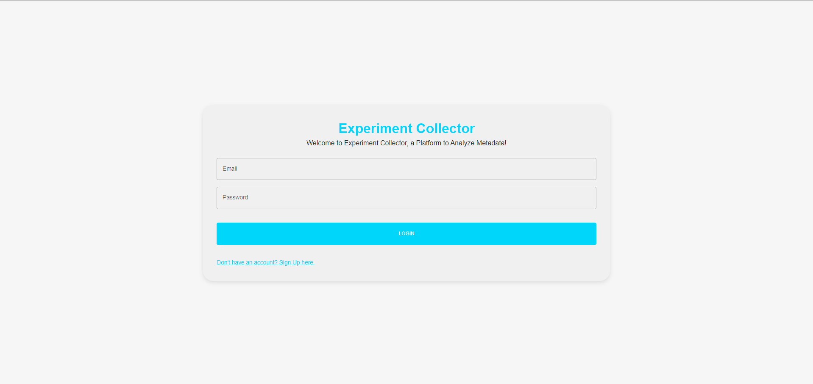

# Experiment_Collector

Welcome to the **Experiment Collector** platform, a comprehensive client-server system designed for collecting and managing experimental data. This repository includes both the client and server implementations necessary for running the entire platform.

## Overview

This project is organized into two main components:

- **Client**: The frontend application built with React, TypeScript, and Vite. This component provides the user interface for interacting with the system.

- **Server**: The backend service that handles data storage on MongoDB, and API endpoints via Express application built with Node.js framework. This component powers the client application and manages the underlying data operations.

## Getting Started

To get started with the Experiment Collector platform, follow these steps:

1. **Clone the Repository**:
   ```bash
   git clone https://github.com/RakefetAckerman/Experiment_Collector.git
   cd Experiment_Collector # To enter into the repository directory
   cd server # To enter the backend part of the system
   # or
   cd client # To enter the frontend part of the system
   ```
## File Structure

```
Experiment_Collector/
│
├── server/                            # The Api / Backend of the website.
├── client/                            # The Frontend of the website.
├── images/                            # The Images for the readme file.
├── .gitignore                         # Files git ignores.
└── README.md                          # README file 
```

## Backend Installation
#### more information can be found in the readme file in the server directory
1. Enter the server: using the terminal enter the server directory using the command ```cd server```
2. **Install Docker:**  If Docker is not already installed, download and install it from [Docker's official website](https://www.docker.com/) based on your operating system.
3. **Env files**: ensure the environment variables files is set correctly - **more information and a template can be found in the readme in the server directory**.  
4. **Build the containers**: using the command 
```bash
docker-compose build
```
5. **Start the containers**: using the command 
```bash
docker-compose up -d
```
6. **Validation** if set correctly, should be greeted with this information in the Docker desktop app 


- check that server-testing-1 passed all tests

## Frontend Installation
#### more information can be found in the readme file in the client directory
1. **Install Node.js** Visit the [Node.js official website](https://nodejs.org/).
- Download the LTS version (which includes npm) suitable for your operating system.
2. **Install dependencies**: 
```bash
    npm install
   ```
3. **Env files**: ensure the environment variables files is set correctly - **more information and a template can be found in the readme in the client directory**.  
4. **Start the frontend server**
```bash
 npm run dev
```
- To start the production server visit the readme in the client directory
6. **Validation** if done correctly vite should view this information in the terminal


7. Visit the url given by vite in your preferred browser. Should be greeted by a login page if done correctly.




